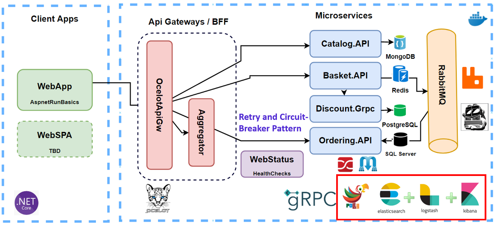
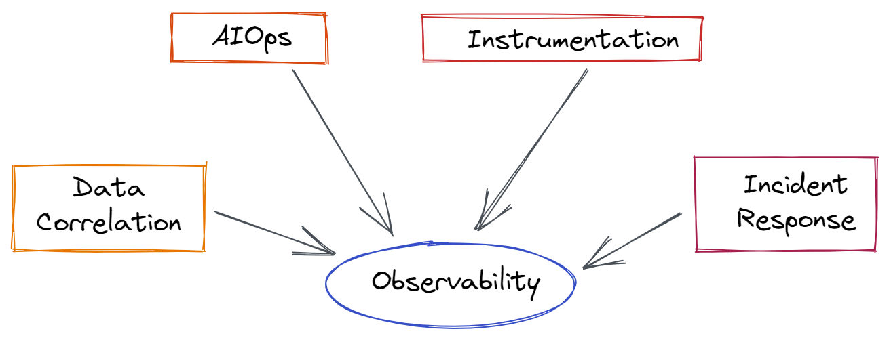

# OBSERVABILITY AND MONITORING OF SOFTWARE

Hi there, 

I'm António Gabriel, I'm angolan and currencly I work as a software developer with some stacks in front and backend such as `Python`, `Php`, `Javascript`, `Go` and more.

In this article I will talk a little about observability and monitoring of softwares and might be I create an example using a tools of observability and monitoring.

So let's get started.

First we need to understand what's observability and monitoring, why we need in our softwares (use case specifications), when use and how to apply.

We start to answer the first point.

## 1. What's Monitoring and Observability.

DORA (DevOps Research and Assessment) define **monitoring** as a tools or technique solution that allow the teams monitorise and understand the state of system.

And **Observability** as a tools or technique solution that allow the teams debug activally a system, exploring properties and patterns not defined with advance.

> Once understood the conpects we can already say that monitoring is an item essential to teams of large performance and in addition of several other technique practices, contribute positively to continuous delivery.

## 2. Why we need in our projects.

To answer these point need to understand some questions related to our clients and performance of application.

- You need reports about the general integrity of your system and ask:  
 
        1. Our system is running?.
        2. Our systems has sufficient resources available?. 

- You need reports about the state of your system according the experiences of your clients and ask:  

        1. Our clients know if the system is down and has a bad experience?.

- You need to monitored the main metrics of business and system.
- You need tools that help you to understand and debug your system in production.

Exist others points related to cases that you can have in your project but I listed only some.

These are a some common questions that you ask to you for know what's the cases I need monitored or wha't I need to monitored.

So obvervability and monitoring go more than thought, in many cases we need thought in how to manage the state of application and user experience.

### 2.1 When use.

The observability and monitoring were created to:

- Provide indicators leads of interruption and degradation of services.

- Detecte interruptions, degradation of services, bugs and activities not authorized.

- Indentify tendencies of long time to planning of capacity and business.

- Help to debug interruptions, degradation of services, bugs and activities not authorized.

So as all resources of DevOps, the installation of a tools is not sufficient to reach the objectives, but can help on work.

Below I copy a figure that illustrate a implementation of observability and monitoring of software.

A complete eccosystem to illustrate.

So we can already define the same in simple term bellow I copy the figure that define.

## 3. How to apply.

